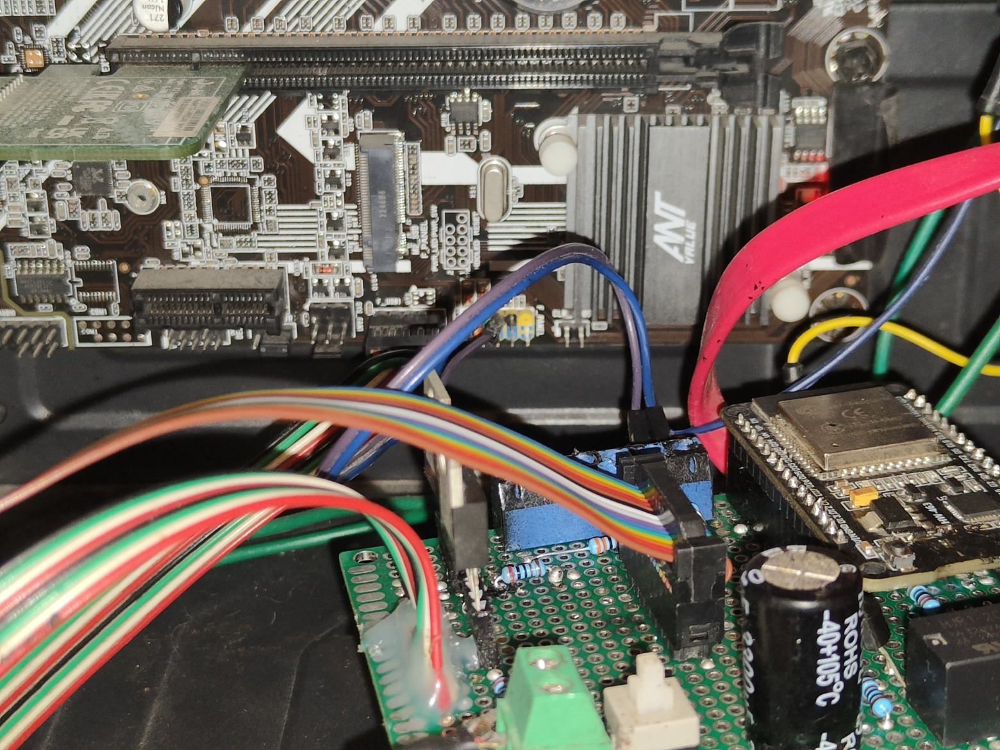
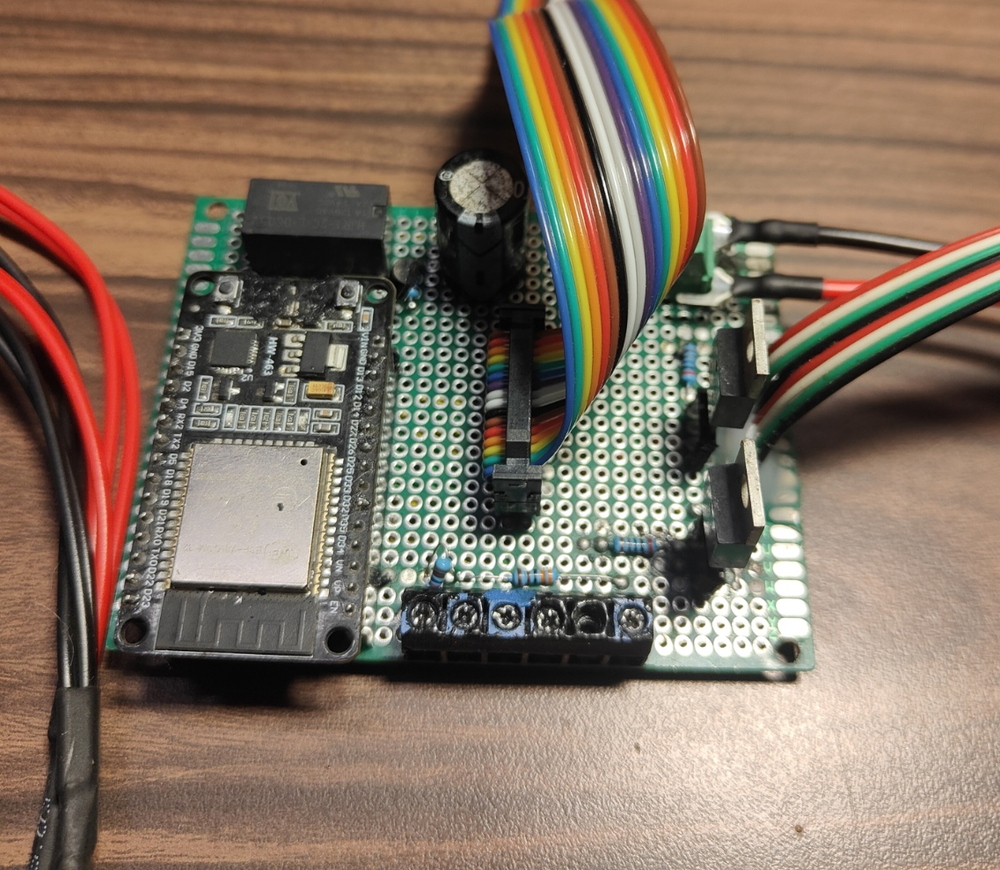
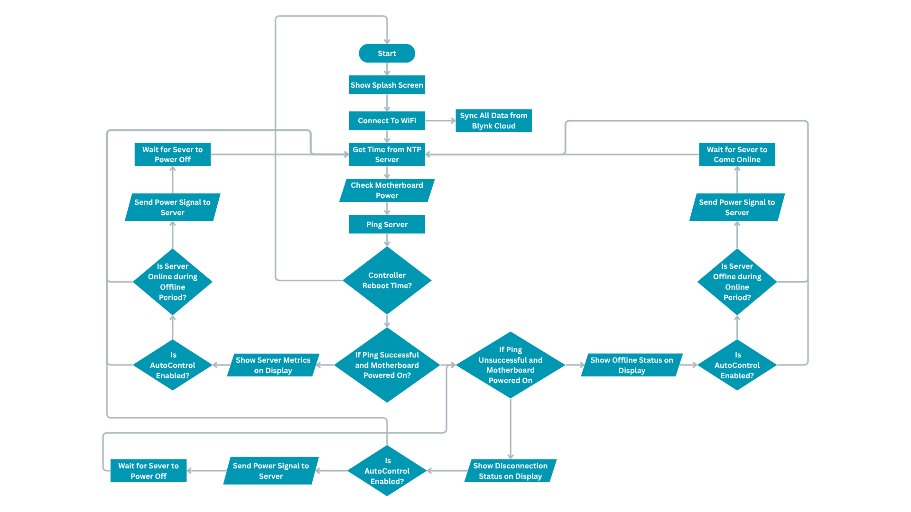
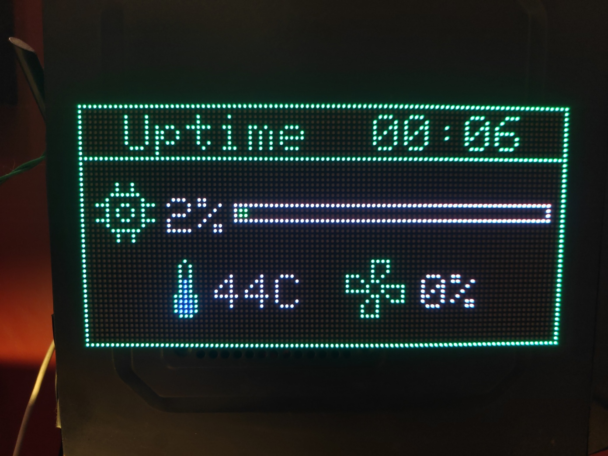
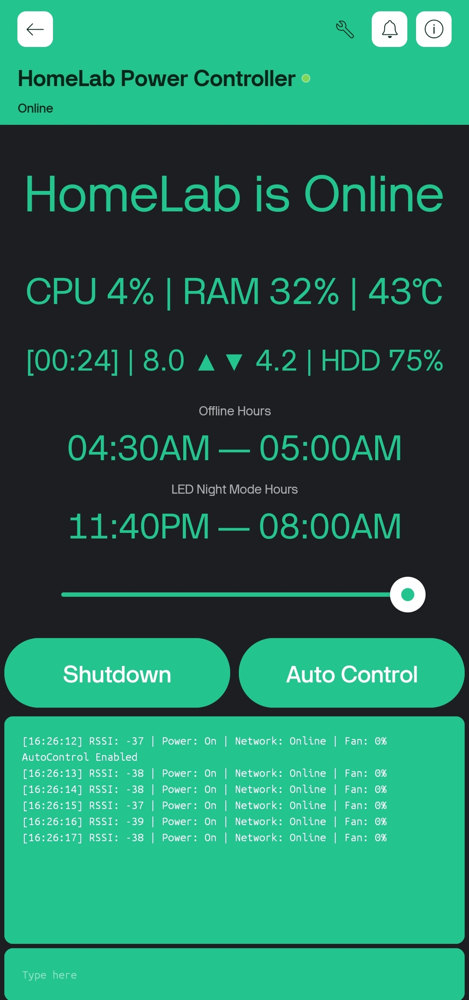

# 🖥️ ESP32 Server Management & Monitoring System **A self-recovering, network-aware, IoT-based power and monitoring controller for home servers.**  ---  ## 📸 Project Gallery  | Circuit Connection | Circuit Board | System Flowchart | |:------------------:|:--------------:|:----------------:| |  |  |  |  | Display – CPU Usage and Temperature | Display – RAM & HDD Usage | Blynk App | |:------------------:|:-------------------:|:----------:| |  |  |  |  ---  ## 🔧 Overview This project is a **custom-built server management system** powered by an **ESP32 microcontroller**, designed to provide **full remote power control, monitoring, and automation** for a home or small-scale server setup.  It acts as a **DIY alternative to IPMI**, combining hardware control, MQTT telemetry, and a visual LED interface into a single, reliable system. The ESP32 continuously monitors the server’s state (via the motherboard’s Power LED and network ping), manages cooling and ambient lighting, and can even **hard reboot itself** if a freeze is detected — ensuring true long-term reliability.  ---  ## ⚙️ Features - 🔌 **Full Power Control** – Remotely power ON/OFF or force shutdown the server via relay-triggered GPIO.   - 🌐 **Real-Time State Detection** – Reads motherboard Power LED and ping responses to determine exact server state (Offline / Disconnected / Online).   - ♻️ **Self-Recovery System** – Hardware circuit (Relay + MOSFET + BJT + Capacitor) performs complete ESP32 power cycle if it becomes unresponsive.   - 🌡️ **Fan Speed Control** – PWM-based temperature-dependent fan control using MOSFET driver.   - 💡 **Ambient Lighting** – Brightness-controllable warm-white LED strips managed through the app.   - 🖥️ **Visual Display** – 96×48 RGB LED matrix shows server metrics and status in real time.   - ☁️ **MQTT Integration** – Fetches CPU, RAM, disk, network, and temperature data via Mosquitto broker.   - 📱 **Remote Access via Blynk IoT** – GUI for control, monitoring, and terminal commands.   - 🔁 **OTA Updates** – Easily upgrade firmware without physical access.  ---  ## 🧠 Technical Highlights - Programmed in **C/C++ (Arduino IDE)** — ~1100 lines of optimized firmware.   - Uses a **single-ping high-frequency detection loop (10–15 Hz)** for faster state updates.   - Built-in **drop counter** avoids false offline detections.   - **DNS failover:** uses `1.1.1.1` to stay independent of home DNS failures.   - Fully **inverter-backed** power for continuous uptime.   - Default GPIO states ensure **fail-safe operation** even during MCU failure.  ---  ## 🧰 Hardware Components | Component | Description | |------------|-------------| | ESP32 | Main controller | | SPDT 5 V Relay | Mechanical relay for self-reboot circuit | | MOSFET ×3 | Fan control, lighting control, relay trigger | | BJT Transistor + 3300 µF Capacitor | Delayed relay power hold for self-restart | | Voltage Divider | Reads 5 V Power LED signal safely at 3.3 V | | 96×48 RGB LED Matrix | Real-time visual status display | | 5 V USB Power | Drawn from motherboard front header (always live) |  ---  ## 🖼️ System Architecture   ---  ## 🚀 Future Plans - Replace Blynk with a **self-hosted Progressive Web App (PWA)** for full control without external dependencies.   - Publish detailed **circuit diagram and PCB layout**.   - Open-source the **Python MQTT publisher** for server metrics.  ---  ## 🛠️ Author **Devansh Tangri**   > Designed, built, and programmed from the ground up to achieve total server autonomy, reliability, and convenience.  ---  ## 🏷️ Repository Tags `ESP32` `IoT` `HomeServer` `Automation` `Blynk` `MQTT` `Hardware` `Arduino` `Microcontroller` `ServerManagement`  ---  ## 📜 License This project is open-source under the **MIT License**.   Feel free to fork, modify, and build upon it for your own setups.